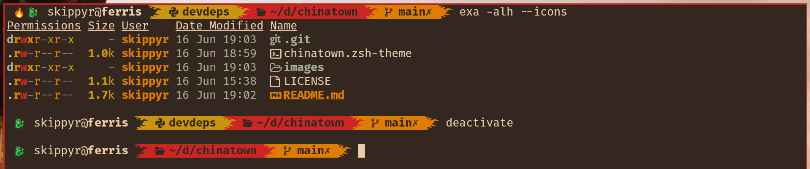

# Chinatown

## Starting Point

The Chinatown project is a dual-line theme for the ZSH shell with a dragon emoji
and flames decorators that uses a powerline style. Its style is inspired by the
popular [Agnoster theme](https://github.com/agnoster/agnoster-zsh-theme).

This theme can be setup with a series of terminal emulators, themes and
wallpapers. You can use following preview as a source of inspiration and
reference to see what it can look like:



> In this preview, the Chinatown was used within the [Kitty terminal emulator](https://github.com/kovidgoyal/kitty)
with the [Twilight theme](https://github.com/kovidgoyal/kitty-themes/blob/master/themes/Twilight.conf).
Font used is [IntelOne Mono (Medium)](https://github.com/intel/intel-one-mono)
with fallback to Nerd Fonts Symbols. Wallpaper is [Landscape photography of waterfalls by Yeo Yonghwan](https://unsplash.com/photos/sS7P1h4Modg) from Unsplash.

## Features

This theme can show you the following information:

* If your last command has failed.
* Your user and hostname.
* The name of sourced virtual environments.
* Your current directory path abbreviated.
* If inside a Git repository, the name of the branch, if has changes to commit and the latest tag.


## Dependencies

This theme has some dependencies that you need to download before installing it.

* git

    This is the terminal utility used to obtain information about your Git
    repositories.

* A font patched by the Nerd Fonts project and an emojis font, like Noto Emoji.

    These fonts provides all pretty symbols used in this theme.

## Installation

You can install this theme in multiple ways, use the one that suits you best.

### Manually

* Run the following command to install the theme at
  `~/.local/share/zsh/themes/chinatown`.

    ```bash
    git clone --depth=1 https://github.com/skippyr/chinatown ~/.local/share/zsh/themes/chinatown &&
    echo "source \"${HOME}/.local/share/zsh/themes/chinatown/chinatown.zsh-theme\"" >> ~/.zshrc
    ```

* Reopen your terminal emulator.

### Within OhMyZSH

* Install the theme in OhMyZSH custom themes' directory.

    ```bash
    git clone --depth=1 https://github.com/skippyr/chinatown ${ZSH_CUSTOM:-${HOME}/.oh-my-zsh/custom}/themes/chinatown
    ```

* Change the value of the `ZSH_THEME` variable in your ZSH configuration file,
  `~/.zshrc`, to use the theme.

    ```bash
    ZSH_THEME="chinatown/chinatown"
    ```

* Reopen your terminal emulator.

## Issues And Contributions

Learn how to report issues and contribute to this project by reading its
[contributions guidelines](https://skippyr.github.io/materials/pages/contributions_guidelines.html).

## License

This project is released under the terms of the MIT license. A copy of the
license is bundled with the source code.

Copyright (c) 2023, Sherman Rofeman. MIT license.

