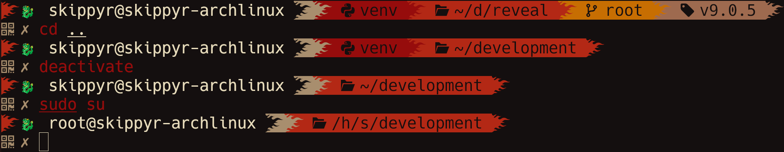

# Chinatown
## About
This repository contains the source code of Chinatown, a powerline theme for the ZSH shell that is decorated by a dragon and flames.

Here is a preview that you can check it out:



> [!NOTE]
> This theme uses the terminal emulator's colors, so they may look different in your setup when compared to the preview.

### Features
This theme can show you:

- If your last command failed, as the dragon will spit fire.
- Your host and user name.
- The name of sourced virtual environments.
- The path of the directory you are in, abbreviating parent directory names by their initials.
- When inside a Git repository, the active branch and the latest tag.

## Installation
### Dependencies
In order to install and run this software properly, the following dependencies must be installed:

- `ZSH`: this is the shell this themes applies on.
- `git`: it will be used to both clone this repository and also to obtain info about your Git repositories to show in the prompt.
- [A Nerd Font's font](https://www.nerdfonts.com/font-downloads) and [an emojis font](https://fonts.google.com/noto/specimen/Noto+Emoji): they provide the pretty symbols used in the prompt.

### Stand-alone Procedures (recommended for most users)
These steps are intended for users that want to perform a stand-alone install of this theme. As it does not need any extra dependency, it is the recommended option for most users.

- Clone this repository using `git`.

```bash
git clone --depth 1 https://github.com/skippyr/chinatown\
                    ~/.local/share/zsh/themes/chinatown
```

- Add the following source rule to your `~/.zshrc` file. Ensure to not source any other theme to avoid conflicts.

```bash
source ~/.local/share/zsh/themes/chinatown/chinatown.zsh-theme
```

- Open a new ZSH session. The theme should now be installed and running.

### OhMyZSH Procedures
These procedures are intended for users that want to use this theme within the OhMyZSH framework.

- Install [OhMyZSH](https://github.com/ohmyzsh/ohmyzsh).
- Clone this repository using `git` to OhMyZSH's custom themes directory.

```bash
git clone --depth 1 https://github.com/skippyr/chinatown\
                    "${ZSH_CUSTOM:-${HOME}/.oh-my-zsh/custom}/themes/chinatown"
```

- Change the value of the `ZSH_THEME` variable in your `~/.zshrc` file to use the theme.

```bash
ZSH_THEME=chinatown/chinatown
```

- Open a new ZSH session. The theme should now be installed and running.

## Support
If you need any kind of support, for instance: help with troubleshooting, have questions about it or want to give improvement suggestions, please report them by filing new issues in its [issues page](https://github.com/skippyr/chinatown/issues).

## Copyright
This software is under the MIT license. A copy of the license is bundled with the source code.
