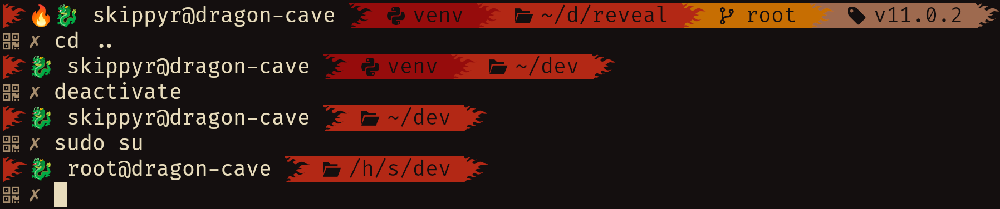

# Chinatown
## About
A theme for the ZSH shell with a dragon.


It can show you:
-   Your host and user names.
-   If inside a Git repository, the branch and tag.
-   Your current directory path abbreviating parent directories.

## Installation
-   Clone this repository.
```bash
git\
    clone --depth=1 https://github.com/skippyr/chinatown\
    ~/.local/share/zsh/themes/chinatown
```

-   Add the following source rule to your `~/.zshrc` file. Ensure to not source
    other theme.

```bash
source ~/.local/share/zsh/themes/chinatown/chinatown.zsh-theme
```

-   Reopen ZSH.

## Copyright
This software is under the MIT license. A copy of the license is bundled with
the source code.
